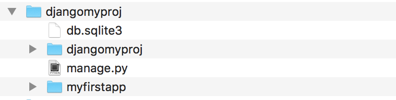
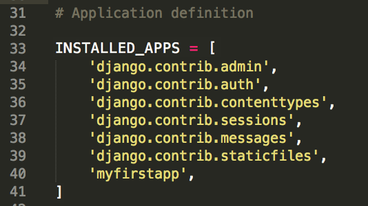
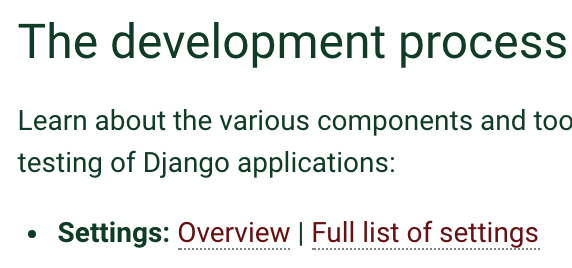
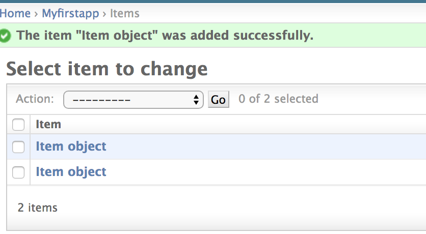
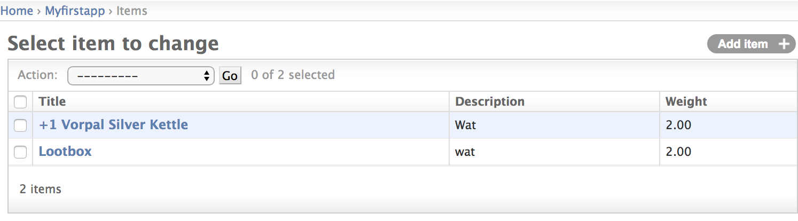
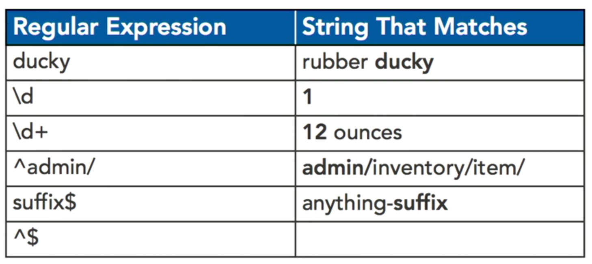

# Notes to Django 1.11 Python 3.6
1.11 taken from udemy django ecommerce<br/>
1.8 taken from Up & Running with Django by Caleb Smith

Install Python 3.6, Virtualenv, & Django on Mac [link](https://www.codingforentrepreneurs.com/blog/install-django-on-mac-or-linux/)<br/>
Python resources [link](https://github.com/codingforentrepreneurs)

## Computer Setup


```
brew install python            installs python 3
brew install python@2          installs python 2.7
                               for django 1.11 (long term support) we need python 3.6.7 
                               later python versions like 3.7 will crash django 1.11
                               I had trouble getting brew to install older python versions so
                               go here and use the macOS 64bit installer to get python 3.6.7
                               https://www.python.org/downloads/release/python-367rc2/
python3 -V                     gets version
pip --version                  python installer of packages,  to get the version of pip
pip3 --version
pip3 install <package>
sudo pip install virtualenv    this is virtual within the confines of a directory
virtualenv --version
```

## Project Setup
```
virtualenv -p python3.6 .      Do this in the project folder,  sets up python3 for that project
source bin/activate            Do this in project folder (to activate shell and prompt will change)
source ../bin/activate         if a level down
deactivate                     

IMPORTANT:  make sure the virtual env is running (the prompt will change)
Within the virtual env you can do the following

pip install django==1.11.16
django-admin --version         to check django is installed
mkdir src                      this is important because startproject creates a /bin and the two bin folders clash
cd src                        
django-admin startproject djangomyproj .
                               make sure you have the . in the above command, this starts a project called 'djangomyproj'
                               you now have manage.py and a folder called 'djangomyproj'
python mamage.py               runs the manage.py file and it displays a list of sub commands
python mamage.py <subcommand>
                               runs django subcommand, for example runserver 
```

`python manage.py runserver` will start a server at 127.0.0.1:8000 (localhost:8000) and this will work immediately after creating a project _but it kicks an error prompting a migration but thats ok_

```
__init__.py         tells it that its a python module (often called the 'dunder' init)
wsgi.py             used by webserver to run the proj (often called the 'wazgi' init)
urls.py             is the config for serverside router
```

## GIT

git should be from within the `src` folder and take .gitignore from [here](https://gist.github.com/LondonAppDev/66c3291e4f487ac92fcc96735e44c35e) but add

```
# OSX
.idea
.DS_Store
*.DS_Store
**/.DS_Store
```

## PEP8 basics
- four space indent

## Django Apps within a Django project
Django 'app' terminology. In the django world an 'app' is a folder with a set of related python files in it, more like a component. A Django project can have multiple apps within it. Each app tends to have a specific purpose for example blog app or forum app and they have a certain structure within their app folder
  - `models.py`         defines data layer (structure of DB tables and how they are queried)
  - `admin.py`          administrative interface (admin for read or update of db tables)
  - `views.py`         control layer (and routing)
  - `tests.py`          tests
  - `migrations/`       folder to hold migrations

## Use the django subcommand to create an app in the django project

```
python manage.py startapp myfirstapp
```

This creates a folder within the project, but it is not yet included in the binary compile<br/>
<br/>
To include it open `djangomyproj/djangomyproj/settings.py` and scroll to `INSTALLED_APPS = [` and add myfirstapp like this, note its a square bracket in django 1.11 where it was a curved parenthesis in 1.8<br/>
<br/>

## The django docs for settings

Find them by going to djangoproject.com click top nav link for documentation, scroll a third of the way down page to subheading The Development Process and under it are some bullets, the first bullet is called Settings and click the Overview link next to it<br/>
<br/>
We already edited a setting above to add myfirstapp app into the compile. If you need to use serverside templating in django you would edit `TEMPLATES = [` in the same file.Other settings commonly altered are static files directory, debug and databases. Check the docs link.

## Models
- each app has a models.py define your classes in there
- classes inherit from django.db.models
- do NOT name your model as a plural as django adds an 's' anyway in the admin
In `/myfirstapp/models.py` define the class like this

```
# not plural (Item not Items)
class Item(models.Model):
    # CharField must have max_length
    title = models.CharField(max_length=200)
    description = models.TextField(blank=True)
    # -1, 0, 1, 20
    amount = models.IntegerField(blank=True, default=0)
    # 0.5, 3.14
    weight = models.DecimalField(decimal_places=2, max_digits=5, blank=True, default=0)
```

```
    title = models.CharField(max_length=10, null=True, blank=True)
    # null is an accepted value that can be stored
    # blank means an empty string is accepted
    # default sets a default
    # choices can set delimeters or guard rails on the values
```

```
    amount = models.PositiveIntegerField(blank=True)
    is_new = models.BooleanField()            # True, False
    date_sold = models.DateTimeField()        #   
    email = models.EmailField()               # george@email.com
    url = models.URLField()                   # www.google.com
    docs = models.FileField()                 # user_uploaded.doc
    pic = models.ImageField()                 # best_avatar.jpg
    owner_id = models.PositiveIntegerField(default=0)
```
postgres JSONField
```
    # models.py must import JSONField
    from django.contrib.postgres.fields import JSONField
    # declare in the model
    mydoc = JSONField()
    # https://docs.djangoproject.com/en/2.1/ref/contrib/postgres/fields/#jsonfield
    # DB will need to be changed from mysql to postgres, see AWS Elephant link below
```
Automatically add date during insert
```
    created_on = models.DateTimeField(auto_now_add=True)
```
Indexing for fields that wil be frequently filtered or sorted (db_index=True)
```
    # https://stackoverflow.com/questions/14786413/add-indexes-db-index-true/14786447
    # https://stackoverflow.com/questions/41496690/django-adding-db-index-to-existing-table
    created_on = models.DateTimeField(db_index=True, auto_now_add=True)
```

## If moving on to DRF notes then...

(Because this is several study courses merged) 

1. Skip "migrations" as we are altering the user table and we want to run migrations afterwards
2. Do this "View the data in sqlitebrowser" however there will be no data to see yet
3. Do this "Register the item model with django admin"
4. Skip "Create Super User for web interface login" as we will do that after the user model is altered
5. Do this "Django out-of-the-box List Display Page is crap, lets fix it"
6. Scroll to bottom and follow the DRF link

## Migrations

Adding the class in models.py doesn't create the table, to do that you need to use a migration. Migrations will add a model, add a field, remove a field or change the attributes of a field
Migrations work by _taking a look at the current state of the DB and current state of our models and seeing what the differences are_, django manages all the changes to our DB on our behalf.
As a side note the migrartions files are readable with the IDE

```
  python manage.py makemigrations
```

- generates migration files for later use, these are stored in the app folder example '/myfirstapp/0001_initial.py'
- compares the current model fields against the current database tables
- do this from the top level above the app folder

```
  python manage.py migrate
```

- runs all migration files that have not been run yet

```
  python manage.py showmigrations
```

- see all the migrations for different apps and which ones have been run (unapplied migrations is the name for those that havent run yet)


## View the data in sqlitebrowser
- download from http://sqlitebrowser.org/ the way I did this was with<br/> 
  `brew cask install db-browser-for-sqlite`
- run the new application DB Browser for SQlite, it should now be in your applications folder
- use it to open the file `db.sqlite3` which is in the main proj folder (above the app folders)
- you will see many tables but the one you want is named appname + underscore + tablename<br/>
  example: `myfirstapp_item`

## Register the item model with django admin
- open admin file in app folder `myfirstapp/admin.py` and then if your model class is called `Item` you would add 

```
from .models import Item
admin.site.register(Item)
```
- _make sure_ you `ctrl-c` and start the server again or the new model will not show in admin

## Create Super User for web interface login
- user terminal to go to top level project folder, this is the folder with `manage.py` and run

```
  python manage.py createsuperuser
  # note: will prompt for username, email and password and its ok to leave email blank
```

- then do `python manage.py runserver` and in the browser url put `http://localhost:8000/admin` then login
- here you can add items to the DB table and view the rows, the row view is not helpful, see next section

## Django out-of-the-box "List Display Page" is crap, lets fix it
<br/>

- to make the row view more useful modify the lines from `myfirstapp/admin.py` so it looks like this

```
from .models import Item 
class ItemAdmin(admin.ModelAdmin):
    list_display = ['id', 'title', 'description', 'amount', 'weight']
    
admin.site.register(Item, ItemAdmin)
```

<br/>
- click on the item to edit it, use the drop down to delete it

## What is Django ORM
- stands for Object Relational Mapper
- maps database columns to python objects

## Using Django shell
- user terminal, make sure you are in top level of project, type `python manage.py shell` and prompt will now look like `>>>`
- from the `>>>` prompt type 

```
  from myfirstapp.models import Item
  #from <app_name>.models import <class_of_model>
```

- then try the following

```
  Item.objects.all()
  # [<Item: Item object>, <Item: Item object>, <Item: Item object>, <Item: Item object>]
  itemsList = Item.objects.all()
  item = itemsList[0]
  item.title
  item.description
  item.id
```

- using the getter

```
  item = Item.objects.get(id=2)
  itemList = Item.objects.filter(weight=2)   # all with weight 2
  itemList = Item.objects.exclude(weight=2)  # all with weight not equal to 2
```

- exit `>>>` with `exit()`

## Django serverside router (empty route)

- open the django app folder that has the _same name_ as the project and open `urls.py` 
- this is the default

```
  urlpatterns = [
    url(r'^admin/', admin.site.urls),
  ]
```

- we added a line for the url and a line to import the views from the app we created

```
  # import views from the app we created
  from myfirstapp import views 

  urlpatterns = [
    # '^$' is regex for empty string see below
    url(r'^$', views.index, name='index'),
    url(r'^admin/', admin.site.urls),
  ]
```

- and most importantly we must go into project folder > app folder > `views.py` and added

```
  from django.http import HttpResponse
  def index(request):
    return HttpResponse('<p>hello world<p/>')
```

- http://localhost:8000/ now shows hello world

Regex screenshot taken from the course, use https://pythex.org/ to test<br/>
<br/>
1st - ducky matches to anywhere in the string<br/>
2nd - \d is only a single digit character<br/>
3rd - \d+ will match to one or more digit characters<br/>
4th - ^ means the string must start with admin/<br/>
5th - similarly $ suffix is the same as ^ except for the end<br/>
6th - this is how to match an empty string<br/>


## Connecting templates with dynamic data to the router

- open the django app folder that has the _same name_ as the project and open `settings.py` and change DIRS 

```
TEMPLATES = [
    {
        'DIRS': [os.path.join(BASE_DIR, 'templates')],
    }
]
```

- in project folder (same level as manage.py) `mkdir templates` and place some html called `home_page.html`
- in project folder > app folder > `views.py` 

```
from django.shortcuts import render
def home_page(request):
    data = {
        "message" : "I need to go to the corner store"
    }
    return render(request, "home_page.html", data)
```

- in project folder > same name folder > `urls.py` 

```
from django.conf.urls import url
from django.contrib import admin
from myfirstapp import views
urlpatterns = [
    url(r'^$', views.home_page),
    url(r'^admin/', admin.site.urls),
]
```
- templates > home_page.html should contain `<p>{{message}}</p>`
- there are ways to loop within the template and filter etc using pipe `|`
- here are some quick ways to get dynamic data onto a server side template

```
# myfirstapp/views.py
from .models import Item
itemsList = Item.objects.all()
def home_page(request):
    data = { 
        "items" : itemsList
    }
    return render(request, "home_page.html", data)
# templates/home_page.html

  <p>{{  item.title }}</p>

```


<hr/>

### Further:
- [python 101 crash course](./python3basics.md)
- [django rest framework](./drf/DRF.md)
- [AWS and ElephantSQL](./aws_elephant.md)

### Additional:
Originally taken from Advanced Django by Kevin Veroneau and Matthew Nuzum (uses python 2.7 and django 1.8)<br/>
Then adapted for django 1.11 and python 3.6

what is middleware?
I like the definition from Matthew Nazum (lynda) he says "middleware is code that hooks into the request response cycle of a page view" and he said this in Advanced Django course


