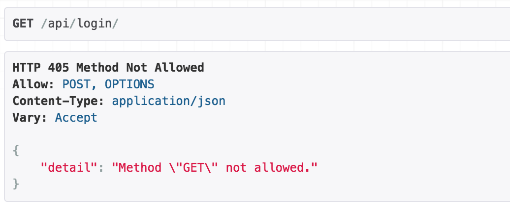
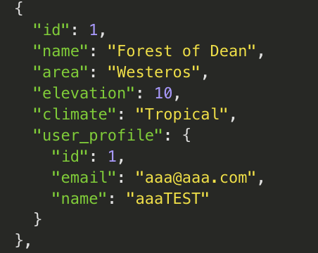

## (optional) VirtualBox and Vagrant

- get virtualbox from virtualbox.org
- get vagrant from vagrantup.com
  after install type `vagrant version` to check it is installed
- do `vagrant init` when in the project folder
- get a vagrant file from the course from here https://gist.github.com/LondonAppDev/d990ab5354673582c35df1ee277d6c24


## DRF

- fire up the virtual env with `source bin/activate`
- above the src folder do `pip install djangorestframework==3.7.7` to add to our virtual environment
- go to settings.py and add `rest_framework` and `rest_framework.authtoken`


```
INSTALLED_APPS = [
    ...
    'rest_framework',
    'rest_framework.authtoken',
]
```

## Save the required python libraries

Almost forgot, its a good idea to list the libs and pipe to a text file.<br/>
Do this inside `/src` so it is included in git.<br/>
Command is this `pip freeze > requirements.txt`

## Create a custom user model to override django's user model
We do this so that the username field during login is the users email and it is treated as unique
1. create a django app called profiles_api<br/>
   `python manage.py startapp profiles_api`<br/>
   add `'profiles_api'` into app `INSTALLED_APPS = [...]`
2. edit the new app `profiles_api/models.py` and use [this code](../profiles_api/models.py) 
3. edit main app `djangomyproj/settings.py` and add a new line at the bottom

```
# custom user model to override django's user model for DRF
AUTH_USER_MODEL = 'profiles_api.UserProfile
```

4. do `python manage.py makemigrations` and `python manage.py migrate` as per my main notes
5. edit the new app `profiles_api/admin.py` 

```
from . import models
class UserAdmin(admin.ModelAdmin):
    list_display = ['id', 'name', 'email', 'is_active', 'is_staff']
admin.site.register(models.UserProfile, UserAdmin)
```

6. do `python manage.py createsuperuser`<br/>
```
    Email: aaa@aaa.com<br/>
    Name: aaa<br/>
    Password: Awesome1<br/>
```
7. do `python manage.py runserver` and test it by login in at /admin

## APIViews

[For APIViews go here LINK](./APIView.md)

## viewsets

[For viewsets go here LINK](./viewsets.md)

## Using a viewset to continue our profiles API

1. in the main app > urls.py add the line<br/>
`url(r'^api/', include('profiles_api.urls')),`
2. create profiles_api > urls.py and add the following code

```
from django.conf.urls import url
from django.conf.urls import include
from rest_framework.routers import DefaultRouter
from . import views

router = DefaultRouter()

# because UserProfileViewSet inherits from viewsets.ModelViewSet it automatically figures out base_name
# the string 'profile' will be in the path but because the main app urls.py is first it is /api/profile/
router.register('profile', views.UserProfileViewSet)
urlpatterns = [
    url(r'', include(router.urls))
]
```

3. create profiles_api > views.py and add the following code

```
from rest_framework import viewsets
from . import serializers
from . import models
# the following two are together
from . import permissions
from rest_framework.authentication import TokenAuthentication

class UserProfileViewSet(viewsets.ModelViewSet):
    """Handles creating, reading and updating profiles."""

    serializer_class = serializers.UserProfileSerializer
    queryset = models.UserProfile.objects.all()

    # the trailing comma is important in order to type this as a tuple
    # the reason these are tuples is you may want to use multiple types of authentication
    authentication_classes = (TokenAuthentication,)
    permission_classes = (permissions.UpdateOwnProfile,)
```

4. create profiles_api > serializers.py and add the following code 

```
from rest_framework import serializers
from . import models


class UserProfileSerializer(serializers.ModelSerializer):
    """A serializer for our user profile objects."""

    class Meta:
        model = models.UserProfile
        fields = ('id', 'email', 'name', 'password', 'is_active')
        # define extra key word arguments for our model
        # special attributes that are predefined in the docs, get applied to password
        # write only is set because then the API will not return the password in the GET
        extra_kwargs = {'password': {'write_only': True}}

    # this create over-rides the existing 'create' provided by serializers.ModelSerializer
    def create(self, validated_data):
        """Create and return a new user."""
        # creates a new user model
        user = models.UserProfile(
            email=validated_data['email'],
            name=validated_data['name']
        )
        # where the hashing takes place
        user.set_password(validated_data['password'])
        user.save()
        return user
```

5. create profiles_api > permissions.py and add the following code

```
from rest_framework import permissions
# https://www.django-rest-framework.org/api-guide/permissions/ 

class UpdateOwnProfile(permissions.BasePermission):
    """Allow users to edit their own profile."""

    # this function is called every time there is a request to our API
    def has_object_permission(self, request, view, obj):
        """Check user is trying to edit their own profile."""
        # if user just wants to view (GET is safe method) then we return True
        if request.method in permissions.SAFE_METHODS:
            return True
        # this allows someone to edit or delete their own account, # but what about admin editing anothers account?
        return obj.id == request.user.id
```

## Login API (and nesting an APIView in a viewset)

DRF has a login API out-of-the box but it is APIView not a viewset however we can trick it so it still works with the DefaultRouter. We do this by creating a viewset that passes the request through to the ObtainAuthToken APIView

edit `profiles_api/urls.py` and add 

```
# now register the login API we are creating setting the base_name because its not a ModelViewSet
router.register('login', views.LoginViewSet, base_name='login')
```

edit `profiles_api/views.py` and add 

```
from rest_framework.authtoken.serializers import AuthTokenSerializer
from rest_framework.authtoken.views import ObtainAuthToken

class LoginViewSet(viewsets.ViewSet):
    """Checks email and password and returns an auth token"""

    serializer_class = AuthTokenSerializer

    # replace the default create method
    def create(self, request):
        """Use the ObtainAuthToken APIView to validate and create a token"""
        # call the post function of a new APIView instance and pass it the request, this will return a new token
        return ObtainAuthToken().post(request)
```

Note that when viewing this in the Django rest browser interface you will see the following and thats because you cannot call a GET on the login API only a POST



Use login POST on super user to get `2b4b914f7d1322280f12e0bf67c8586d7acd9e8e`

## Using the Modheader Chrome Plugin

- hit + and add a filter `*localhost*` as you dont want to wrteck other sites you browse to
- set Request Header to `Token` and `2b4b914f7d1322280f12e0bf67c8586d7acd9e8e`
- if you go to profiles_api and view the superuser you should have options to edit due to the token
- if you view a different user the permissions should prevent you from editing as the token does not match

## Permissions - prevent anyone seeing the users list unless they are logged in

edit `profiles_api/views.py` and add 
```
from rest_framework.permissions import IsAuthenticated
    permission_classes = (IsAuthenticated,)
```
now when making a GET request it will return 401 Unauthorized unless you are logged in<br/>
optionally you may want to allow GET for non logged in users and PATCH for those that are logged in
```
from rest_framework.permissions import IsAuthenticatedOrReadOnly
    permission_classes = (IsAuthenticatedOrReadOnly,)
```
this can be combined with the permission we wrote earler to prevent a user editing other users profiles 
```
permission_classes = (permissions.UpdateOwnProfile, IsAuthenticated)
```

## Foreign keys

In the model simply specify models.ForeignKey() to build a relation to another table and the id of the record in that table can be recorded. Also it will be checked so an invalid id cannot be saved there with a POST.<br/>
This is stored as a number so in the simple example of three user accounts created the following below can have lookout records with the value of 1,2,3 or null<br/>
in `lookoutapp/models.py` add
```
    # if creating a relation to a model in another app then prefix the name of app onto the model
    user_profile = models.ForeignKey('profiles_api.UserProfile', on_delete=models.CASCADE)
```
```
    # if adding this field after the data has been created then 
    user_profile = models.ForeignKey('profiles_api.UserProfile', on_delete=models.CASCADE, blank=True, null=True)
```

Generally you want thin views and thick serializers but in the case where you want the lookout record to be automatically created with the current logged in user then you must recognize that the serializer does not have visiblity to the request so in the viewset we must override the create method that would normally be overridden in the serializer. Do this with perform_create()

- https://stackoverflow.com/questions/41094013/when-to-use-serializers-create-and-modelviewsets-create-perform-create
- see also video 58 of the udemy course

so in `lookoutapp/views.py` you would add 
```
    def perform_create(self, serializer):
        serializer.save(user_profile=self.request.user)
```

## Foreign keys and nested serializer

In the above example the users id number will be recorded in the user_profile foreign key field of the lookout record<br/>
But if we want something more useful such as the user's name, id and other things we can do this because its a foreign key using a nested serializer<br/>
in `profiles_api/serializers.py` add
```
class UserProfileSerializerLite(serializers.ModelSerializer):
    class Meta:
        model = models.UserProfile
        fields = ('id', 'email', 'name')
```
in `lookoutapp/serializers.py` change it to
```
from profiles_api.serializers import UserProfileSerializerLite
class LookoutSerializer(serializers.ModelSerializer):
    user_profile = UserProfileSerializerLite(read_only=True)
    class Meta:
        model = models.Lookout
        fields = ('id', 'name', 'area', 'elevation', 'climate', 'user_profile')
```
gives us this<br/>


## Soft Delete

https://stackoverflow.com/questions/44317929/overriding-djangorest-viewsets-delete-behavior


